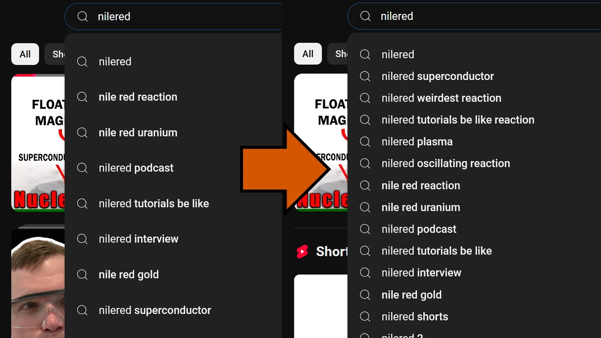

## Revert YouTube Search Suggestions Size
Reverts the height of YouTube Search Suggestions to the previous value after the recent redesign (from 52px back to 35px).  
[As seen on userstyles.world](https://userstyles.world/style/20987/revert-youtube-search-suggestions-size)  

 

 

### Installation:
1. Install a userstyle browser extension like Stylus ([Firefox](https://addons.mozilla.org/en-US/firefox/addon/styl-us/), [Chrome](https://chromewebstore.google.com/detail/stylus/clngdbkpkpeebahjckkjfobafhncgmne))
2. [Click here to install the userstyle](https://github.com/Sv443/Revert-YouTube-Search-Suggestions-Size/raw/refs/heads/main/Revert-YouTube-Search-Suggestions-Size.user.css)

  

Made with :heart: by Sv443 - please consider [supporting the development](https://github.com/sponsors/Sv443)  
Licensed under the [MIT license](./LICENSE.txt)

